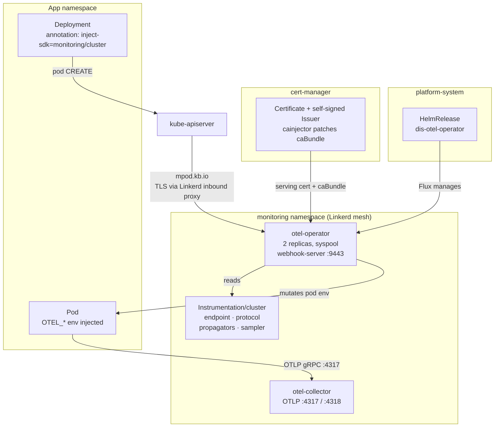

# OTel SDK Auto-Instrumentation via Operator Annotations

**Date:** 2026-09-23
**Status:** Implemented in the same PR as this spec; rollout pending (see Rollout plan).
Revised during implementation after checking the draft against chart `0.122.0` and
operator `v0.158.0` source — see Revisions.
**Packages touched:** `oci/otel-operator`, `oci/otel-collector`

## Summary

Let application teams opt a workload into OpenTelemetry configuration with a single
pod annotation, instead of hand-maintaining five environment variables per app.

An app that today writes this:

```yaml
env:
  - name: OTEL_EXPORTER_OTLP_ENDPOINT
    value: http://otel-collector.monitoring.svc.cluster.local:4317
  - name: OTEL_EXPORTER_OTLP_PROTOCOL
    value: grpc
  - name: OTEL_SERVICE_NAME
    value: access-management
  - name: POD_UID
    valueFrom:
      fieldRef:
        apiVersion: v1
        fieldPath: metadata.uid
  - name: OTEL_RESOURCE_ATTRIBUTES
    value: "k8s.pod.uid=$(POD_UID)"
```

writes this instead:

```yaml
spec:
  template:
    metadata:
      annotations:
        instrumentation.opentelemetry.io/inject-sdk: "monitoring/cluster"
      labels:
        app.kubernetes.io/name: access-management
        app.kubernetes.io/version: "1.4.2"
```

and gets a superset of the same environment, plus `k8s.namespace.name`,
`k8s.node.name`, `k8s.deployment.name`, `service.instance.id` and
`service.namespace`. The last two feed the service's identity in Application
Insights and AMW: the collector drops the operator's `service.namespace` again so that
service names stay unchanged (C6), and `service.instance.id` becomes the per-pod
instance ID (see D2).

## Goals

- One annotation opts a workload in. No per-app OTel environment plumbing.
- Endpoint, protocol, propagators and sampler are changed in one place, by one commit.
  Running pods pick a change up when they are recreated; injection happens only at
  pod creation.
- Nothing is injected into any workload that has not explicitly opted in.
- Migration is incremental and reversible per workload.

## Non-goals

- **Language agent auto-instrumentation** (`inject-java`, `inject-dotnet`, …). Those
  add an init container carrying a real agent, which would require mirroring six
  upstream images into `altinncr.azurecr.io` and accepting startup and memory
  overhead. Out of scope; the design does not preclude adding it later.
- **Replacing the collector's `k8sattributes` enrichment.** The operator sets
  resource attributes at the SDK; the collector continues to enrich server-side.
  Both must keep agreeing on `k8s.pod.uid` (see Verification).
- **Changing the tail-sampling strategy** or the `dis.otel/sampling` label contract.

## Background: how instrumentation works today

`oci/otel-collector` runs a collector in `monitoring` that receives OTLP on 4317
(gRPC) and 4318 (HTTP) from any meshed pod in the cluster, enriches via
`k8sattributes`, tail-samples traces, and exports to Application Insights and an
Azure Monitor Workspace. Application teams wire their SDK to it by hand.

`oci/otel-operator` runs the OpenTelemetry Operator, which reconciles the
`OpenTelemetryCollector` CR. Its admission webhooks are **disabled**:

```yaml
# oci/otel-operator/base/helmrelease.yaml
manager:
  env:
    ENABLE_WEBHOOKS: "false"
admissionWebhooks:
  create: false
```

This dates from `b459ef1 chore: move otel manifests to dis-way (#131)`, the original
cut-and-paste import — not from a deliberate later decision.

All `instrumentation.opentelemetry.io/inject-*` handling happens in the operator's
`mpod.kb.io` pod-mutating webhook. With webhooks off, the annotations are inert, and
because that webhook's `failurePolicy` is `Ignore`, pods are admitted **silently
un-instrumented** — no error, no event, nothing in the operator log. Enabling the
webhook is therefore the substance of this change; the `Instrumentation` CR is the
easy part.

## Decisions

### D1 — SDK-only injection

`inject-sdk` injects environment variables only: no init container, no sidecar, no
volume. Applications keep their own OTel SDK, which they already ship. This exactly
replaces the environment block above and adds no new images to mirror.

### D2 — `service.name` from labels, with an explicit override

`spec.defaults.useLabelsForResourceAttributes: true`, **and** the README documents
`resource.opentelemetry.io/service.name` as the authoritative override.

The operator resolves `service.name` first-found-wins:

1. `OTEL_SERVICE_NAME` already on the container
2. `resource.opentelemetry.io/service.name` annotation
3. `app.kubernetes.io/instance` label, **then** `app.kubernetes.io/name` label
4. `k8s.deployment.name` → replicaset → statefulset → daemonset → cronjob → job → pod → container name

Step 3 is the trap: `instance` is checked **before** `name`, and Helm sets `instance`
to the release name. Any chart whose release name differs from its service name would
silently rename itself in Application Insights, breaking dashboards and alerts. (Tail
sampling is unaffected: it keys on `http.route`, `dis.otel.sampling`, status and
latency, not on the service name.) The documented annotation override is the escape
hatch, and it outranks every label.

The operator never overwrites an `OTEL_SERVICE_NAME` the container declares in `env`,
so teams can annotate first, delete the env var later, and compare the two side by
side in between.

`service.name` is not the whole identity, though. The operator also always sets
`service.namespace` (the pod's namespace, unless a `resource.opentelemetry.io/service.namespace`
annotation says otherwise) and `service.instance.id` (`<namespace>.<pod>.<container>`),
and the collector's exporters fold both into the service's identity:

| Sink | Today | Opted in, as exported | Opted in, with C6 |
|------|-------|-----------------------|-------------------|
| Application Insights `cloud_RoleName` (`azuremonitor`) | `<service>` | `<namespace>.<service>` | `<service>` |
| Application Insights `cloud_RoleInstance` | SDK-dependent | `<namespace>.<pod>.<container>` | same |
| AMW `job` label (`prometheusremotewrite`) | `<service>` | `<namespace>/<service>` | `<service>` |
| AMW `instance` label | SDK-dependent | `<namespace>.<pod>.<container>` | same |

(`contracts_utils.go` `applyCloudTagsToEnvelope` and `prometheusremotewrite/helper.go`
in collector-contrib `v0.140.1`, the image `collector.yaml` runs.) The rename happens
the moment a workload is annotated, whatever its own `OTEL_SERVICE_NAME` says, and
cannot be switched off per pod — an empty annotation falls back to the namespace. The
approved draft listed `service.namespace` as a free extra. Since keeping service names
stable is the point of this decision, C6 drops the operator-set `service.namespace` in
the collector (R11). The per-pod instance ID is kept: instances are ephemeral anyway,
and it is more meaningful than what SDKs generate.

### D3 — One `Instrumentation` CR, referenced explicitly

A single `Instrumentation/cluster` in `monitoring`. Workloads reference it by
`<namespace>/<name>`:

```yaml
instrumentation.opentelemetry.io/inject-sdk: "monitoring/cluster"
```

Rejected alternatives:

- **Replicate per namespace via a Kyverno `generate` policy** so apps could write the
  shorter `inject-sdk: "true"`. Makes Kyverno a dependency of the observability path,
  creates N copies to keep in sync, and adds "my namespace's copy is stale" as a new
  failure mode.
- **Namespace-level annotation.** Zero per-app change, but it is opt-*out*: jobs and
  utility pods get environment they did not ask for. It also interacts badly with the
  operator's precedence rules — a pod annotated `"true"` *loses* to a namespace-level
  value, so a team could not pin a different CR with the short form.

The explicit reference is opt-in per workload, which keeps the blast radius at one
Deployment at a time and makes the rollout incremental by construction. The cost is a
verbose annotation value that hardcodes the `monitoring` namespace.

## Architecture



Ordering: the operator package must reach a ring **before** the collector package
version carrying the CR. Per-ring versions in `oci/releaseconfig.json` make this
explicit.

## Changes

### C1 — `oci/otel-operator/base/helmrelease.yaml`

```yaml
spec:
  dependsOn:                           # the multitenancy overlay patches the namespace to platform-system
    - name: cert-manager
      namespace: cert-manager
  values:
    replicaCount: 2
    pdb:
      create: true
      minAvailable: 1
    manager:
      env:
        ENABLE_WEBHOOKS: "true"        # was "false"
    admissionWebhooks:
      create: true                     # was false
      certManager:
        enabled: true                  # chart's self-signed Issuer; cert-manager is already deployed
      pods:
        failurePolicy: Ignore          # chart default, stated explicitly because it is load-bearing
      timeoutSeconds: 5                # three mutating webhooks now run in sequence per pod CREATE
      namespaceSelector:
        matchExpressions:
          - key: control-plane
            operator: DoesNotExist     # the exclusion AKS documents; `monitoring` carries no such label
```

`replicaCount: 2` plus the PDB is not strictly required to make the feature work. It
is included because at one replica every syspool node drain is a window in which
pods come up un-instrumented — and `failurePolicy: Ignore` makes that failure
invisible. The operator runs `--enable-leader-election`, so extra replicas are safe.

All other existing values (image registries, `podAnnotations`, tolerations,
`nodeSelector`) are unchanged.

No `install.crds` / `upgrade.crds` policy is set. The draft pinned both to `Create` to
keep the conversion stanza off existing clusters, but those policies only govern a
chart's `crds/` directory, and this chart has none — it renders its CRDs as ordinary
templates (see The CRD conversion webhook). The pins would have been no-ops.

### C2 — `oci/otel-operator/policies/` (new layer)

Modelled on `oci/azure-service-operator/policies/linkerd-policies.yaml`. Added to
`oci/otel-operator/multitenancy/kustomization.yaml` only, matching how
`oci/otel-collector` wires its `policies` layer.

```yaml
---
# kube-apiserver → operator admission webhook
apiVersion: policy.linkerd.io/v1beta3
kind: Server
metadata:
  name: otel-operator-webhook
  namespace: monitoring
spec:
  podSelector:
    matchLabels:
      app.kubernetes.io/name: opentelemetry-operator
      app.kubernetes.io/component: controller-manager
  port: webhook-server
  proxyProtocol: TLS
---
apiVersion: policy.linkerd.io/v1alpha1
kind: NetworkAuthentication
metadata:
  name: kube-api-server
  namespace: monitoring
spec:
  networks:
    - cidr: ${AKS_POD_IPV4_CIDR:=10.240.0.0/16}
    - cidr: ${AKS_POD_IPV6_CIDR:=fd10:59f0:8c79:240::/64}
    - cidr: ${AKS_VNET_IPV4_CIDR}
    - cidr: ${AKS_VNET_IPV6_CIDR}
---
apiVersion: policy.linkerd.io/v1alpha1
kind: AuthorizationPolicy
metadata:
  name: otel-operator-webhook
  namespace: monitoring
spec:
  targetRef:
    group: policy.linkerd.io
    kind: Server
    name: otel-operator-webhook
  requiredAuthenticationRefs:
    - group: policy.linkerd.io
      kind: NetworkAuthentication
      name: kube-api-server
```

`DEFAULT_INBOUND_POLICY` defaults to `all-unauthenticated`
(`oci/linkerd/base/helmrelease.yaml:98`), so the webhook would reach the operator
without these policies today. They exist so the webhook survives anyone tightening
that variable, and because the policies layer is the repo convention.

This makes `AKS_VNET_IPV4_CIDR` and `AKS_VNET_IPV6_CIDR` required variables for the
package. Both are already supplied cluster-side for `azure-service-operator`.

Needs `oci/otel-operator/policies/README.md` in the Linkerd Policy README format from
`CLAUDE.md` (Overview, Architecture, Resources, Why This Matters, Variables).

### C3 — `oci/otel-collector/base/instrumentation.yaml` (new)

Added to `oci/otel-collector/base/kustomization.yaml`, so every layer that includes
`base` picks it up.

```yaml
apiVersion: opentelemetry.io/v1alpha1
kind: Instrumentation
metadata:
  name: cluster
  namespace: monitoring
spec:
  # Derive service.name/service.version from standard app labels, falling back to
  # the owning workload. resource.opentelemetry.io/* annotations outrank both.
  defaults:
    useLabelsForResourceAttributes: true
  exporter:
    endpoint: http://otel-collector.monitoring.svc.cluster.local:4317
  env:
    # Not a CRD field, so it has to live here. Most SDKs default to http/protobuf,
    # which the collector serves on 4318 — pointing that default at 4317 fails.
    - name: OTEL_EXPORTER_OTLP_PROTOCOL
      value: grpc
  propagators:
    - tracecontext
    - baggage
  resource:
    # A pod has no UID yet when the webhook sees it, so k8s.pod.uid is only
    # injected (via the downward API) with this enabled. k8sattributes needs it to
    # match telemetry to its pod - see pod_association in collector.yaml.
    addK8sUIDAttributes: true
  # Head sampling passes everything through; the collector owns the decision via
  # tail_sampling (see the Tail Sampling Strategy table in this package's README).
  sampler:
    type: parentbased_always_on
```

`v1alpha1` is correct and current: `Instrumentation` has no `v1beta1`, unlike
`OpenTelemetryCollector`.

`resource.addK8sUIDAttributes` is required, not optional. Mutating admission runs
before the API server assigns the pod its UID (`registry/generic/registry/store.go`
fills it in `Create`, after admission), so the operator's `pod.UID` is empty and it
adds `k8s.pod.uid` only through the `OTEL_RESOURCE_ATTRIBUTES_POD_UID` downward-API
fallback — which is gated on this flag (`injectCommonSDKConfig` in operator
`v0.158.0`). Without it every migrated workload would lose `k8s.pod.uid` once its
hand-written `POD_UID` is deleted, which is exactly the V6 failure. The flag also adds
the owners' UIDs (`k8s.deployment.uid`, `k8s.replicaset.uid`, …); like the names, these
are fixed per pod, so they add attributes but not series.

The endpoint is hardcoded rather than parameterised. This is the same package that
defines the collector, so a `${OTEL_URL}` variable would be indirection pointing at
itself. (`oci/kyverno` legitimately uses `${OTEL_URL}`/`${OTEL_PORT}` because it is a
foreign package pointing at this service.)

`spec.exporter.endpoint` is used rather than putting the endpoint in `spec.env`.
Both work — `spec.env` entries are injected first and `configureExporter` skips any
variable already present — but the typed field appears in `kubectl get otelinst`'s
printer column.

### C4 — Documentation

- **`oci/otel-collector/README.md`** — extend the existing "Developer View" section
  with the annotation contract (below), add `Instrumentation` to the Layers table, and
  explain C6 under How It Works.
- **`oci/otel-operator/README.md`** — new; the package has none. Use the OCI Package
  README format from `CLAUDE.md`, and document that enabling webhooks makes
  cert-manager a startup dependency.
- **`oci/otel-operator/policies/README.md`** — new, per C2.

### C5 — Release registration

Both packages are already registered in `release-please-config.json` and
`.release-please-manifest.json`. Only `oci/releaseconfig.json` ring versions change,
during rollout.

### C6 — `oci/otel-collector/base/collector.yaml`: keep service names stable

Added during implementation (R11). A `transform` processor drops `service.namespace`
when it equals `k8s.namespace.name`, as the first processor after `memory_limiter` in
all three pipelines:

```yaml
transform/servicenamespace:
  error_mode: ignore
  trace_statements:   # likewise log_statements and metric_statements
    - context: resource
      statements:
        - delete_key(attributes, "service.namespace") where attributes["service.namespace"] != nil and attributes["service.namespace"] == attributes["k8s.namespace.name"]
```

It runs before `k8sattributes`, which adds `k8s.namespace.name` to every pod's
telemetry. At this point the attribute can only have come from the SDK itself — in
practice from the operator, which sets both — so services that set their own
`service.namespace` keep it. The exception is a service that sets `service.namespace`
to its own namespace: once it opts in, the operator adds the equal `k8s.namespace.name`
(leaving the service's own `service.namespace` alone), and the value is dropped. A
service whose SDK already sends both loses it at Phase 2 already. V0 (c) finds these
services before rollout.

Verified with `otelcol-contrib` `0.140.1`, the collector's own version: `validate`
accepts the rendered `multitenancy` and `adminservices` configs (and rejects a
deliberately broken statement), and a functional run over OTLP traces, metrics and
logs dropped `service.namespace` only where it equalled `k8s.namespace.name`.

## App-facing contract

```yaml
spec:
  template:
    metadata:
      annotations:
        instrumentation.opentelemetry.io/inject-sdk: "monitoring/cluster"
        # multi-container pods only — the default targets .spec.containers[0]
        instrumentation.opentelemetry.io/container-names: "app"
      labels:
        app.kubernetes.io/name: access-management
        app.kubernetes.io/version: "1.4.2"
```

**What the operator then injects**, per opted-in container:

| Variable | Source |
|----------|--------|
| `OTEL_EXPORTER_OTLP_ENDPOINT` | `spec.exporter.endpoint` |
| `OTEL_EXPORTER_OTLP_PROTOCOL` | `spec.env` |
| `OTEL_SERVICE_NAME` | derived (see D2) |
| `OTEL_RESOURCE_ATTRIBUTES` | `k8s.namespace.name`, `k8s.container.name`, `k8s.pod.name`, `k8s.pod.uid`, `k8s.node.name`, `service.instance.id`, `service.namespace`, `service.version` (`app.kubernetes.io/version`, else the image tag), plus owner-derived `k8s.deployment.name` / `k8s.replicaset.name` / `k8s.statefulset.name` / `k8s.daemonset.name` / `k8s.job.name` / `k8s.cronjob.name` and the matching `*.uid` |
| `OTEL_RESOURCE_ATTRIBUTES_POD_NAME` | downward API, `metadata.name` |
| `OTEL_RESOURCE_ATTRIBUTES_POD_UID` | downward API, `metadata.uid` (requires `spec.resource.addK8sUIDAttributes`, see C3) |
| `OTEL_RESOURCE_ATTRIBUTES_NODE_NAME` | downward API, `spec.nodeName` |
| `OTEL_POD_IP`, `OTEL_NODE_IP` | downward API, `status.podIP` / `status.hostIP` |
| `OTEL_PROPAGATORS` | `spec.propagators` |
| `OTEL_TRACES_SAMPLER` | `spec.sampler.type` |

**What the app can then delete:** `OTEL_EXPORTER_OTLP_ENDPOINT`,
`OTEL_EXPORTER_OTLP_PROTOCOL`, `OTEL_SERVICE_NAME`, `POD_UID`,
`OTEL_RESOURCE_ATTRIBUTES`. Custom keys in `OTEL_RESOURCE_ATTRIBUTES` (e.g.
`deployment.environment`) must move to `resource.opentelemetry.io/<key>` pod
annotations first, or they are lost with it.

**Rules to document:**

- The annotation goes on `spec.template.metadata.annotations`, **not**
  `spec.metadata.annotations`. This is the single most common mistake.
- `resource.opentelemetry.io/service.name: <name>` pins the service name and
  outranks every label. Use it whenever the Helm release name is not the service name.
- `app.kubernetes.io/instance` is checked **before** `app.kubernetes.io/name`.
- Any `OTEL_*` variable the container already sets in `env` wins; the operator skips
  it. Only `container.Env` is checked: values from `envFrom` are invisible to the
  operator and are overridden by what it injects, since `env` takes precedence over
  `envFrom`. Variables are filled independently, so endpoint and protocol must be set
  together or not at all.
- `OTEL_RESOURCE_ATTRIBUTES` is the exception — the computed string is appended,
  comma-joined, with already-present keys skipped, except `k8s.pod.name`,
  `k8s.pod.uid` and `k8s.node.name`, which are appended again with the same values.
- Injection happens on **pod CREATE only**. Adding the annotation to a workload's pod
  template rolls it out as usual; a change to the `Instrumentation` reaches running
  pods only when they are recreated.
- `instrumentation.opentelemetry.io/container-names` is a comma-separated list of
  names from `.spec.containers` or `.spec.initContainers`, matching
  `^[a-zA-Z0-9-,]+$` — a value with spaces leaves the pod un-instrumented, and unknown
  names are skipped. Without it the operator targets `.spec.containers[0]`, which in a
  Linkerd-meshed pod is the app container: Linkerd `edge-26.7.2`, which every ring
  runs, injects `linkerd-proxy` as a native sidecar in `.spec.initContainers`
  (`proxy.nativeSidecar: true` by default since `edge-26.5.2`). A workload that opts
  out with `config.linkerd.io/proxy-enable-native-sidecar: "false"` gets the proxy
  at `/spec/containers/0` (`proxy.await`), and is still safe only because
  kube-apiserver runs mutating webhook configurations sorted by name
  (`mutating_webhook_manager.go`) and `dis-otel-operator-opentelemetry-operator-mutation`
  sorts before `linkerd-proxy-injector-webhook-config`. Name the containers
  explicitly for any pod with more than one application container.

## Ramifications of enabling the admission webhook

### Webhook inventory

Enabling `admissionWebhooks.create: true` renders one `MutatingWebhookConfiguration`
(`dis-otel-operator-opentelemetry-operator-mutation`) and one
`ValidatingWebhookConfiguration` (`…-validation`), holding seven webhooks — not just
the pod one:

| Webhook | Resource | Ops | failurePolicy |
|---|---|---|---|
| `mpod.kb.io` | `pods` | CREATE | `Ignore` (separate `pods.failurePolicy` knob) |
| `minstrumentation.kb.io` | `instrumentations` | CREATE, UPDATE | `Fail` |
| `mopentelemetrycollectorbeta.kb.io` | `opentelemetrycollectors` | CREATE, UPDATE | `Fail` |
| `vinstrumentationcreateupdate.kb.io` | `instrumentations` | CREATE, UPDATE | `Fail` |
| `vopentelemetrycollectorcreateupdatebeta.kb.io` | `opentelemetrycollectors` | CREATE, UPDATE | `Fail` |
| `vinstrumentationdelete.kb.io` | `instrumentations` | DELETE | hardcoded `Ignore` |
| `vopentelemetrycollectordeletebeta.kb.io` | `opentelemetrycollectors` | DELETE | hardcoded `Ignore` |

**The existing collector CR gains a fail-closed validating webhook.**
`oci/otel-collector/base/collector.yaml` has been applied unvalidated since #131. If
anything in it trips `vopentelemetrycollectorcreateupdatebeta.kb.io`, Flux's next
apply starts failing. This must be dry-run before the operator bump reaches any ring
(see Verification V0).

### The CRD conversion webhook

`conf/crds/crd-opentelemetrycollector.yaml` wraps a conversion stanza in
`{{- if .Values.admissionWebhooks.create }}`:

```yaml
conversion:
  strategy: Webhook
  webhook:
    clientConfig:
      service:
        name: …-webhook
        path: /convert
```

Conversion webhooks have **no `failurePolicy`** — when called they fail closed, for
reads as well as writes. But the API server only calls one when a request actually
needs conversion, i.e. when the requested version differs from the version the object
is stored at; objects already at the target version skip the webhook. The collector CR
is authored as `v1beta1`, which is also the CRD's storage version, so reads and writes
by Flux, `kubectl get otelcol` and the operator do not go through it. Only a `v1alpha1`
request — or an object still stored at `v1alpha1` — would, and only those fail while
the operator is down.

The draft assumed Flux's CRD policy keeps this stanza off existing clusters. It does
not apply: `install.crds` / `upgrade.crds` govern only a chart's `crds/` directory, and
since chart `0.57.0` this chart has none. Its CRDs are rendered as ordinary
templates by `templates/admission-webhooks/operator-webhook.yaml`
(`tpl (.Files.Get "conf/crds/…")`, gated on `crds.create`, default `true`), which this
repo has used since the import at chart `0.102.0`. Helm therefore manages the CRDs like
any other release object:

- **Every cluster**, existing or rebuilt, gets the conversion stanza on the upgrade that
  enables webhooks, with the `caBundle` filled in by cainjector via the CRD's
  `cert-manager.io/inject-ca-from` annotation. There is no divergence between
  existing and rebuilt clusters.
- **Disabling webhooks again** renders the CRD without the stanza, and Helm's upgrade
  patch (a JSON merge patch, for CRDs) removes it.

The conversion webhook still buys nothing here, but it is the chart's standard
configuration and costs nothing unless a `v1alpha1` request arrives. V0 checks
the CRD's `status.storedVersions` before rollout.

Keep `crds.create` at `true`. The CRDs carry no `helm.sh/resource-policy: keep`, so
dropping them from the release would delete them — and every `OpenTelemetryCollector`
and `Instrumentation` with them.

### The selector constraint

The chart renders **one** `namespaceSelector` and **one** `objectSelector` across all
seven webhooks. Consequences:

- Pod injection **cannot** be scoped to opted-in namespaces without simultaneously
  disabling validation and defaulting for the `Instrumentation` and collector CRs in
  `monitoring`.
- `objectSelector` is unusable for this purpose outright — it would be evaluated
  against the `Instrumentation` and `OpenTelemetryCollector` objects too.

The only safe selector is the AKS-documented exclusion,
`key: control-plane, operator: DoesNotExist`, which `monitoring` passes because it
carries no such label.

This is acceptable because scoping is not where the safety comes from: **injection is
annotation-gated**, so the webhook is invoked for every pod CREATE but mutates almost
none. The cost is one extra round-trip per pod creation, not a mutation risk — with
one caveat (R10): the handler decodes every pod into the operator's `corev1.Pod` type
and answers with `PatchResponseFromRaw(original, re-encoded)`
(`internal/webhook/podmutation/webhookhandler.go`), so pod fields newer than the
operator's `k8s.io/api` would be stripped from every pod in the cluster.

### Availability and admission-chain behaviour

Every pod CREATE now traverses the operator, joining Linkerd's proxy-injector and
Kyverno's admission controller — three sequential mutating webhooks. Upstream is
explicit that ordering should not be relied on: "Mutating admission webhooks don't
run in a consistent order." All three must be idempotent; the operator's injection
is, since it skips any variable the container already declares. In practice
kube-apiserver sorts webhook configurations by name, so the operator runs before
Kyverno's and Linkerd's. The default container selection only depends on that for
workloads that opt out of Linkerd's native sidecar (see App-facing contract).

Because `mpod.kb.io` is `Ignore` with `sideEffects: None`, an operator outage can
never block pod creation. The failure mode is silent non-instrumentation, not a
stalled cluster. This is also why the self-deadlock scenario upstream warns about
does not apply — that scenario requires a webhook that *rejects*, and `Ignore` cannot.

`timeoutSeconds` is lowered from the chart's 10 to 5. Range is 1–30.

### cert-manager becomes a startup dependency

`templates/deployment.yaml` mounts the webhook serving-cert secret **unconditionally**
when `admissionWebhooks.create: true`. If cert-manager has not issued the
`Certificate`, the operator pod sits in `ContainerCreating` — and the operator is also
the collector's reconciler. The `cert-manager.io/inject-ca-from` annotation
additionally requires cainjector to be running to patch the caBundle.

The draft made this a deployment-repo handoff (a Flux `Kustomization` `dependsOn`).
It is handled here instead, the way `azure-service-operator` and `linkerd` already do
it: the HelmRelease `dependsOn` the `cert-manager` HelmRelease (C1), which is only
Ready once cert-manager's install or upgrade has completed, cainjector included. A
Kustomization-level `dependsOn` would only wait for the cert-manager Kustomization to
*apply*, unless that Kustomization sets `wait: true`.

**Handoff items** — these do live in the deployment repo:

- The otel-operator `Kustomization` must set `spec.postBuild` and supply
  `AKS_VNET_IPV4_CIDR` and `AKS_VNET_IPV6_CIDR` (C2). This package had no variables
  before, and kustomize-controller substitutes only when `postBuild` is set — without
  it even the defaulted pod CIDRs stay literal. Linkerd's admission rejects the
  unparseable `cidr`, and the whole package, HelmRelease included, fails to apply (R9).
- The otel-collector `Kustomization` should `dependsOn` the otel-operator one, and for
  that to mean anything the otel-operator `Kustomization` needs `wait: true` (or a
  health check on the operator Deployment); without either it is Ready as soon as it
  applies. This orders bootstrap and upgrades. It does not help during an outage: Flux
  dry-runs every object on every reconciliation, the dry-runs of the `Instrumentation`
  and collector CRs pass through fail-closed webhooks, and the collector package
  cannot reconcile while the operator is unreachable (R12) — the protection there is
  the two replicas and the PDB.

### AKS specifics

- AKS supports custom admission webhooks and states its admissions enforcer
  "automatically excludes `kube-system` and AKS internal namespaces". C1 additionally
  applies the exclusion AKS documents.
- AKS "firewalls the API server egress so that your admission controller webhooks need
  to be accessible from within the cluster" — satisfied; the webhook service is
  in-cluster.
- The widely repeated claim that a fail-closed webhook blocks AKS node scale-up or
  cluster upgrade is **not** present in the AKS FAQ, support-policies or upgrade
  documentation. It is deliberately not relied on here.

## Rollout plan

Ring by ring through `oci/releaseconfig.json`, at22/at23 first, operator before
collector.

| Phase | Action |
|-------|--------|
| 0 | Pre-flight checks (V0): stored CRD versions in the first ring, a dry-run of the collector CR against the validating webhook, and services that already send `service.namespace`. |
| 1 | Bump `otel-operator` in `at_ring1`. Verify V1–V3. |
| 2 | Bump `otel-collector` in `at_ring1`. Verify V4. |
| 3 | Annotate `oci/whoami` as the injection canary. Verify V5. Revert the annotation afterwards. |
| 4 | One real application: annotate, verify V6, then delete its hardcoded OTel env in a second commit. |
| 5 | Remaining rings: `at_ring2` → `tt_ring1` → `tt_ring2` → `prod_ring1` → `prod_ring2`. |

`oci/whoami` is the canary because it is in-repo, meshed, and trivial. It ships no
OTel SDK so it emits no telemetry — but it proves *injection*, which is the thing
being changed.

## Verification

`kustomize build oci/otel-operator`, `oci/otel-operator/multitenancy`,
`oci/otel-collector` and `oci/otel-collector/multitenancy` must all render. The
`pull-request.yml` workflow builds `oci/*`, `oci/*/apps`, `oci/*/multitenancy`,
`oci/*/adminservices`, `oci/*/platform-aks` and `oci/*/edge`; `policies` is covered
transitively via `multitenancy`.

Cluster checks — run against at22/at23 first. Per `CLAUDE.md`, `kubectl` is not run
without explicit confirmation.

- **V0** — (a) `kubectl get crd opentelemetrycollectors.opentelemetry.io -o
  jsonpath='{.status.storedVersions}'` is `["v1beta1"]`; if `v1alpha1` is listed, some
  objects may still be stored at `v1alpha1`, and reading them would go through the
  conversion webhook. (b) The collector CR passes the validating webhook. In a ring,
  use `flux diff kustomization <otel-collector Kustomization> --path
  oci/otel-collector/multitenancy`, which server-side dry-runs with the
  Kustomization's own substitutions and field manager; in a scratch cluster, pipe
  `kustomize build oci/otel-collector/multitenancy | flux envsubst --strict` (with
  representative values exported), filtered to the two CRs with `yq
  'select(.kind=="OpenTelemetryCollector" or .kind=="Instrumentation")'`, into
  `kubectl apply --server-side --dry-run=server -f -` — a scratch cluster lacks the
  ExternalSecret and Linkerd CRDs the rest of the layer needs. A plain `kubectl apply -k` sends unsubstituted `${…}` values under kubectl's
  field manager and fails for reasons unrelated to the webhook. The webhook only
  exists once Phase 1 has landed, so run (b) in a scratch cluster with the chart at
  C1's values before Phase 1, or in the first ring straight after it. A rejection there
  blocks reconciliation of the collector package, not the running collector. Reading the
  `v0.158.0` validator found no rejection path this CR hits: it uses no mode-gated
  fields, its ports already parse in the running reconciler, and the RBAC-escalation
  check is skipped while `createRbacPermissions` is off. (c) Before Phase 2, since C6
  applies to all telemetry: list services that already set `service.namespace` equal
  to their namespace. In Application Insights: `union requests, dependencies, traces,
  exceptions | where timestamp > ago(7d) | extend sns =
  tostring(customDimensions["service.namespace"]) | where isnotempty(sns) and sns ==
  tostring(customDimensions["k8s.namespace.name"]) | distinct cloud_RoleName`. For
  metrics-only senders, in AMW: `group by (job, service_namespace, k8s_namespace_name)
  ({service_namespace!=""})` — the labels exist because `transform/metrics` merges
  resource attributes into them. Every listed service loses the `<namespace>.` prefix
  from its `cloud_RoleName` when it opts in, because the operator then sends the equal
  `k8s.namespace.name`. Those whose SDK already sends `k8s.namespace.name` lose it at
  Phase 2. A team that wants to keep a namespaced role name has to use a
  `service.namespace` that differs from the Kubernetes namespace.
- **V1** — `kubectl get certificate -n monitoring` shows Ready; the
  `MutatingWebhookConfiguration` and `ValidatingWebhookConfiguration` have a non-empty
  `caBundle` on every entry, and so does `spec.conversion.webhook.clientConfig` on the
  `opentelemetrycollectors.opentelemetry.io` CRD.
- **V2** — both operator replicas are Ready, and the webhook answers on both.
  controller-runtime `v0.24.1`, which operator `v0.158.0` uses, does not gate webhook
  serving on leader election (`DefaultServer.NeedLeaderElection()` returns `false`),
  so this confirms in the cluster what the source already shows.
- **V3** — the collector still reconciles: `kubectl get otelcol -n monitoring` and the
  Flux Kustomization stays Ready.
- **V4** — `kubectl get otelinst -n monitoring` shows `cluster` with the expected
  Endpoint and Sampler printer columns, and existing services keep their
  `cloud_RoleName` and `job` after the collector bump (C6 sees all telemetry).
- **V5** — annotate `oci/whoami`'s pod template (the change rolls its pods) and
  confirm the injected environment on the `whoami` container — `linkerd-proxy`, a
  native sidecar in `initContainers`, gets none: endpoint, protocol,
  `OTEL_SERVICE_NAME=whoami`, and an `OTEL_RESOURCE_ATTRIBUTES` containing
  `k8s.pod.uid`.
- **V6** — on the first real app, compare before and after: (a) `service.name` is
  unchanged; (b) `k8s.pod.uid` survives — it is what the collector's `k8sattributes`
  `pod_association` keys on (`oci/otel-collector/base/collector.yaml`), and losing it
  would break server-side enrichment for that workload; (c) `cloud_RoleName` in
  Application Insights and `job` in AMW are unchanged (C6), while `cloud_RoleInstance`
  and `instance` become `<namespace>.<pod>.<container>`; (d) its
  metric series stay within AMW's labels-per-series limit, since `transform/metrics`
  copies every resource attribute into labels and opting in adds several; (e)
  `mpod.kb.io` latency (`apiserver_admission_webhook_admission_duration_seconds`)
  stays well under the 5 s timeout — the operator's owner lookups retry on a cache
  miss.

## Rollback

| Scope | Action |
|-------|--------|
| One workload | Remove the annotation, restore its env vars if already deleted, restart. |
| One ring | Revert the package version in `oci/releaseconfig.json`. |
| The webhook | Revert C1. The `MutatingWebhookConfiguration`, `ValidatingWebhookConfiguration`, `Certificate` and `Issuer` are ordinary templates, so Helm removes them on downgrade. Already-injected pods keep their env until restarted, which is harmless. |

The rollback is symmetric, including the collector CRD: the CRDs are templates too, so
reverting C1 re-renders `opentelemetrycollectors.opentelemetry.io` without
`spec.conversion` and Helm removes the stanza. The draft's concern — a rebuilt cluster
left with a `/convert` endpoint nobody serves — does not arise. Check it after a
revert anyway: `kubectl get crd opentelemetrycollectors.opentelemetry.io -o
jsonpath='{.spec.conversion.strategy}'` should print `None`.

## Risks and open items

| # | Risk | Mitigation |
|---|------|------------|
| R1 | Existing collector CR fails the newly-active validating webhook, blocking Flux. | V0 dry-run, in a scratch cluster or straight after Phase 1. The `v0.158.0` validator was read against the CR and no rejection path applies; V0 is the definitive check. |
| R2 | cert-manager unavailable at bootstrap leaves the operator in `ContainerCreating`, stalling collector reconciliation too. | HelmRelease `dependsOn` the `cert-manager` HelmRelease (C1), as `azure-service-operator` and `linkerd` already do. |
| R3 | Every cluster gets a fail-closed conversion webhook on the collector CRD. | Only called for `v1alpha1` ↔ `v1beta1` conversion; nothing in the repo requests `OpenTelemetryCollector` at `v1alpha1`. V0 (a) checks stored versions, V1 checks its `caBundle`. Accepted. |
| R4 | A chart's `app.kubernetes.io/instance` differs from its service name, renaming it in App Insights. | `resource.opentelemetry.io/service.name` override documented; V6 compares before/after per app. |
| R5 | Webhook serving might be gated on leader election, making the second replica dead weight. | Resolved from source: controller-runtime `v0.24.1`'s webhook server does not need leader election, so both replicas serve. V2 confirms in the cluster. |
| R6 | Added latency on every pod CREATE cluster-wide. | `timeoutSeconds: 5`; injection is annotation-gated so the mutation path is near-empty. |
| R7 | Node drain with one replica silently un-instruments pods created in that window. | `replicaCount: 2` + PDB (C1). |
| R8 | A workload that opts out of Linkerd's native sidecar has `linkerd-proxy` at `containers[0]`; it is then only skipped because the operator's webhook configuration sorts before Linkerd's. Renaming the release or setting `admissionWebhooks.namePrefix` could inject into the proxy instead. | No workload in the repo opts out. Documented in both READMEs; V5 checks which container received the env; `container-names` removes the dependency. |
| R9 | The otel-operator Flux `Kustomization` has no `postBuild` substitution (this package had no variables before), so the `NetworkAuthentication` CIDRs stay literal, Linkerd rejects them, and nothing in the package applies. | Enable `postBuild` and supply `AKS_VNET_*` before Phase 1 — **handoff to the deployment repo**, alongside R2. |
| R10 | Every pod CREATE is round-tripped through the operator's typed `corev1.Pod`; pod fields newer than its `k8s.io/api` would be stripped cluster-wide. | Keep the operator (Renovate) current, and check its `k8s.io/api` version before each AKS minor upgrade. |
| R11 | Opting in changes the service's identity: `cloud_RoleName` becomes `<namespace>.<service>` in Application Insights and `job` becomes `<namespace>/<service>` in AMW, because the operator always sets `service.namespace` (D2). | **Decided: keep today's names.** C6 drops the operator-set `service.namespace` in the collector. Residual: a service that sets `service.namespace` to its own namespace loses the prefix too — on opt-in, or at Phase 2 if its SDK already sends `k8s.namespace.name`. V0 (c) lists such services before Phase 2; to keep a namespaced name they need a `service.namespace` other than the namespace. |
| R12 | While the operator is unreachable, Flux cannot reconcile any of `oci/otel-collector`, because the dry-runs of both CRs pass through fail-closed webhooks. | Two replicas + PDB (C1). For bootstrap and upgrade ordering, the otel-collector `Kustomization` `dependsOn` otel-operator, with `wait: true` on the latter — **handoff to the deployment repo**. |

## References

- [OpenTelemetry Operator — automatic instrumentation](https://opentelemetry.io/docs/platforms/kubernetes/operator/automatic/)
- [Operator docs — SDK-only injection](https://github.com/open-telemetry/opentelemetry-operator/blob/main/docs/auto-instrumentation/languages/sdk-only.md)
- [Operator docs — resource attributes](https://github.com/open-telemetry/opentelemetry-operator/blob/main/docs/auto-instrumentation/resource-attributes.md)
- [Kubernetes — admission webhook good practices](https://kubernetes.io/docs/concepts/cluster-administration/admission-webhooks-good-practices/)
- [AKS FAQ — admission controller webhooks](https://learn.microsoft.com/en-us/azure/aks/faq)
- [Flux — HelmRelease CRD policies](https://fluxcd.io/flux/components/helm/helmreleases/)
- Upstream source checked during implementation:
  - chart `opentelemetry-operator-0.122.0`: `templates/admission-webhooks/operator-webhook.yaml`,
    `conf/crds/crd-opentelemetrycollector.yaml`, `templates/deployment.yaml`, `values.schema.json`
  - [operator `v0.158.0` — `internal/instrumentation/sdk.go`](https://github.com/open-telemetry/opentelemetry-operator/blob/v0.158.0/internal/instrumentation/sdk.go),
    [`internal/webhook/collector_webhook.go`](https://github.com/open-telemetry/opentelemetry-operator/blob/v0.158.0/internal/webhook/collector_webhook.go),
    [`internal/webhook/podmutation/webhookhandler.go`](https://github.com/open-telemetry/opentelemetry-operator/blob/v0.158.0/internal/webhook/podmutation/webhookhandler.go)
  - Linkerd `edge-26.7.2` — [`values.yaml`](https://github.com/linkerd/linkerd2/blob/edge-26.7.2/charts/linkerd-control-plane/values.yaml) (`proxy.nativeSidecar: true`) and
    [`charts/patch/templates/patch.json`](https://github.com/linkerd/linkerd2/blob/edge-26.7.2/charts/patch/templates/patch.json) (proxy in `initContainers`, or at `containers/0` with `proxy.await` when opted out)
  - [kube-apiserver — `mutating_webhook_manager.go`](https://github.com/kubernetes/kubernetes/blob/master/staging/src/k8s.io/apiserver/pkg/admission/configuration/mutating_webhook_manager.go) (configurations sorted by name)
  - collector-contrib `v0.140.1` — [`exporter/azuremonitorexporter/contracts_utils.go`](https://github.com/open-telemetry/opentelemetry-collector-contrib/blob/v0.140.1/exporter/azuremonitorexporter/contracts_utils.go) (`cloud_RoleName`),
    [`pkg/translator/prometheusremotewrite/helper.go`](https://github.com/open-telemetry/opentelemetry-collector-contrib/blob/v0.140.1/pkg/translator/prometheusremotewrite/helper.go) (`job` / `instance`)
  - [controller-runtime `v0.24.1` — `pkg/webhook/server.go`](https://github.com/kubernetes-sigs/controller-runtime/blob/v0.24.1/pkg/webhook/server.go) (`NeedLeaderElection` is `false`)
- In-repo precedents: `oci/azure-service-operator/policies/linkerd-policies.yaml`,
  `oci/linkerd/post-deploy/rollout-restart-job.yaml`, `oci/otel-collector/README.md`

## Revisions

Changes from the approved draft, made while implementing it:

1. **C1 no longer pins `install.crds` / `upgrade.crds`.** The chart renders its CRDs as
   templates, so those policies never applied. Consequently the collector CRD's
   conversion webhook lands on every cluster, not only rebuilt ones, and the rollback
   is symmetric. Rewrote The CRD conversion webhook, Rollback and R3 accordingly.
2. **C3 sets `resource.addK8sUIDAttributes: true`.** Without it the operator never
   injects `k8s.pod.uid`, and migrated workloads would lose the attribute the
   collector's `pod_association` keys on.
3. **Linkerd runs its proxy as a native sidecar in `initContainers`**, not appended to
   `containers`: every ring runs `edge-26.7.2`, where `proxy.nativeSidecar` defaults
   to `true`. `containers[0]` is therefore the app. Only a workload that opts out of
   native sidecars gets the proxy at `containers[0]`, where the operator's webhook
   sorting before Linkerd's keeps it safe. Corrected the App-facing contract rule and
   V5, and added R8 for the opt-out case.
4. **V0 split into a stored-versions check and a dry-run**, noting that the dry-run
   needs the validating webhook, which only exists once Phase 1 has landed.
5. **Added R9**: the `AKS_VNET_*` variables C2 makes required are a deployment-repo
   handoff.

After an independent review of the implementation:

6. **`service.namespace` is a rename, not a free extra** (D2, R11). The operator always
   sets it, and the exporters fold it into `cloud_RoleName` and the AMW `job` label.
   Documented, with accepting it versus stripping it in the collector left open —
   decided in item 10.
7. **The contract rules are more precise**: only `env` is honoured, not `envFrom`;
   variables are filled one at a time; three resource keys are appended twice;
   `container-names` must match `^[a-zA-Z0-9-,]+$`; custom resource keys need
   annotations before `OTEL_RESOURCE_ATTRIBUTES` is deleted; and an `Instrumentation`
   change reaches only recreated pods (Goals, rules, a comment in C3's file).
8. **Handoffs and risks.** R9 now requires enabling `postBuild`, not just supplying
   variables. Added R12 (an operator outage blocks all collector reconciliation; the
   replicas and PDB are the mitigation) and R10 (every pod is round-tripped through
   the operator's typed Pod). R5 is resolved from controller-runtime source. V0(b) uses
   `flux diff kustomization`, and V6 now also checks identity, label count and webhook
   latency. Tail sampling does not key on the service name, which the draft's D2
   claimed it did.
9. **cert-manager ordering moved into this repo** (R2). The HelmRelease `dependsOn` the
   `cert-manager` HelmRelease, as `azure-service-operator` and `linkerd` do, instead of
   a deployment-repo `Kustomization` `dependsOn`. The latter only waits for the
   dependency to apply unless it sets `wait: true`, which the collector → operator
   handoff (R12) now spells out.
10. **R11 decided: keep today's service names.** Added C6, a collector `transform`
    that drops the operator-set `service.namespace` before `k8sattributes`, so
    `cloud_RoleName` and the AMW `job` label do not change when a workload opts in.
    Added V0 (c) for the residual case — services that set `service.namespace` to their
    own namespace, which the final review pointed out lose it on opt-in too — and
    updated V4 and V6.
