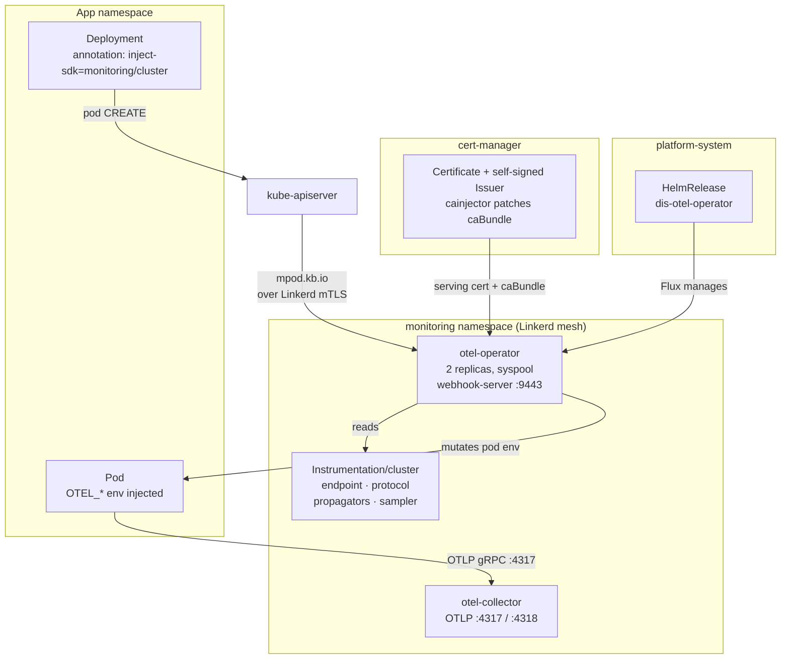

# OTel SDK Auto-Instrumentation via Operator Annotations

**Date:** 2026-09-23
**Status:** Draft — design approved, implementation not started
**Packages touched:** `oci/otel-operator`, `oci/otel-collector`

## Summary

Let application teams opt a workload into OpenTelemetry configuration with a single
pod annotation, instead of hand-maintaining five environment variables per app.

An app that today writes this:

```yaml
env:
  - name: OTEL_EXPORTER_OTLP_ENDPOINT
    value: http://otel-collector.monitoring.svc.cluster.local:4317
  - name: OTEL_EXPORTER_OTLP_PROTOCOL
    value: grpc
  - name: OTEL_SERVICE_NAME
    value: access-management
  - name: POD_UID
    valueFrom:
      fieldRef:
        apiVersion: v1
        fieldPath: metadata.uid
  - name: OTEL_RESOURCE_ATTRIBUTES
    value: "k8s.pod.uid=$(POD_UID)"
```

writes this instead:

```yaml
spec:
  template:
    metadata:
      annotations:
        instrumentation.opentelemetry.io/inject-sdk: "monitoring/cluster"
      labels:
        app.kubernetes.io/name: access-management
        app.kubernetes.io/version: "1.4.2"
```

and gets a superset of the same environment, plus `k8s.namespace.name`,
`k8s.node.name`, `k8s.deployment.name`, `service.instance.id` and
`service.namespace` for free.

## Goals

- One annotation opts a workload in. No per-app OTel environment plumbing.
- Endpoint, protocol, propagators and sampler are changed in one place, by one commit.
- Nothing is injected into any workload that has not explicitly opted in.
- Migration is incremental and reversible per workload.

## Non-goals

- **Language agent auto-instrumentation** (`inject-java`, `inject-dotnet`, …). Those
  add an init container carrying a real agent, which would require mirroring six
  upstream images into `altinncr.azurecr.io` and accepting startup and memory
  overhead. Out of scope; the design does not preclude adding it later.
- **Replacing the collector's `k8sattributes` enrichment.** The operator sets
  resource attributes at the SDK; the collector continues to enrich server-side.
  Both must keep agreeing on `k8s.pod.uid` (see Verification).
- **Changing the tail-sampling strategy** or the `dis.otel/sampling` label contract.

## Background: how instrumentation works today

`oci/otel-collector` runs a collector in `monitoring` that receives OTLP on 4317
(gRPC) and 4318 (HTTP) from any meshed pod in the cluster, enriches via
`k8sattributes`, tail-samples traces, and exports to Application Insights and an
Azure Monitor Workspace. Application teams wire their SDK to it by hand.

`oci/otel-operator` runs the OpenTelemetry Operator, which reconciles the
`OpenTelemetryCollector` CR. Its admission webhooks are **disabled**:

```yaml
# oci/otel-operator/base/helmrelease.yaml
manager:
  env:
    ENABLE_WEBHOOKS: "false"
admissionWebhooks:
  create: false
```

This dates from `b459ef1 chore: move otel manifests to dis-way (#131)`, the original
cut-and-paste import — not from a deliberate later decision.

All `instrumentation.opentelemetry.io/inject-*` handling happens in the operator's
`mpod.kb.io` pod-mutating webhook. With webhooks off, the annotations are inert, and
because that webhook's `failurePolicy` is `Ignore`, pods are admitted **silently
un-instrumented** — no error, no event, nothing in the operator log. Enabling the
webhook is therefore the substance of this change; the `Instrumentation` CR is the
easy part.

## Decisions

### D1 — SDK-only injection

`inject-sdk` injects environment variables only: no init container, no sidecar, no
volume. Applications keep their own OTel SDK, which they already ship. This exactly
replaces the environment block above and adds no new images to mirror.

### D2 — `service.name` from labels, with an explicit override

`spec.defaults.useLabelsForResourceAttributes: true`, **and** the README documents
`resource.opentelemetry.io/service.name` as the authoritative override.

The operator resolves `service.name` first-found-wins:

1. `OTEL_SERVICE_NAME` already on the container
2. `resource.opentelemetry.io/service.name` annotation
3. `app.kubernetes.io/instance` label, **then** `app.kubernetes.io/name` label
4. `k8s.deployment.name` → replicaset → statefulset → daemonset → cronjob → job → pod → container name

Step 3 is the trap: `instance` is checked **before** `name`, and Helm sets `instance`
to the release name. Any chart whose release name differs from its service name would
silently rename itself in Application Insights, breaking dashboards, alerts and the
collector's tail-sampling rules. The documented annotation override is the escape
hatch, and it outranks every label.

Migration is safe regardless: the operator never overwrites an `OTEL_SERVICE_NAME`
the container already declares. Teams annotate first, delete the env var later, and
can compare the two side by side in between.

### D3 — One `Instrumentation` CR, referenced explicitly

A single `Instrumentation/cluster` in `monitoring`. Workloads reference it by
`<namespace>/<name>`:

```yaml
instrumentation.opentelemetry.io/inject-sdk: "monitoring/cluster"
```

Rejected alternatives:

- **Replicate per namespace via a Kyverno `generate` policy** so apps could write the
  shorter `inject-sdk: "true"`. Makes Kyverno a dependency of the observability path,
  creates N copies to keep in sync, and adds "my namespace's copy is stale" as a new
  failure mode.
- **Namespace-level annotation.** Zero per-app change, but it is opt-*out*: jobs and
  utility pods get environment they did not ask for. It also interacts badly with the
  operator's precedence rules — a pod annotated `"true"` *loses* to a namespace-level
  value, so a team could not pin a different CR with the short form.

The explicit reference is opt-in per workload, which keeps the blast radius at one
Deployment at a time and makes the rollout incremental by construction. The cost is a
verbose annotation value that hardcodes the `monitoring` namespace.

## Architecture



Ordering: the operator package must reach a ring **before** the collector package
version carrying the CR. Per-ring versions in `oci/releaseconfig.json` make this
explicit.

## Changes

### C1 — `oci/otel-operator/base/helmrelease.yaml`

```yaml
spec:
  install:
    crds: Create          # pinned: Flux's real default is Create, not the Skip its API comment claims
    remediation:
      retries: 5
  upgrade:
    crds: Create          # keeps the conversion stanza off already-installed collector CRDs
    remediation:
      retries: 5
  values:
    replicaCount: 2
    pdb:
      create: true
      minAvailable: 1
    manager:
      env:
        ENABLE_WEBHOOKS: "true"        # was "false"
    admissionWebhooks:
      create: true                     # was false
      certManager:
        enabled: true                  # chart's self-signed Issuer; cert-manager is already deployed
      pods:
        failurePolicy: Ignore          # chart default, stated explicitly because it is load-bearing
      timeoutSeconds: 5                # three mutating webhooks now run in sequence per pod CREATE
      namespaceSelector:
        matchExpressions:
          - key: control-plane
            operator: DoesNotExist     # the exclusion AKS documents; `monitoring` carries no such label
```

`replicaCount: 2` plus the PDB is not strictly required to make the feature work. It
is included because at one replica every syspool node drain is a window in which
pods come up un-instrumented — and `failurePolicy: Ignore` makes that failure
invisible. The operator runs `--enable-leader-election`, so extra replicas are safe.

All other existing values (image registries, `podAnnotations`, tolerations,
`nodeSelector`) are unchanged.

### C2 — `oci/otel-operator/policies/` (new layer)

Modelled on `oci/azure-service-operator/policies/linkerd-policies.yaml`. Added to
`oci/otel-operator/multitenancy/kustomization.yaml` only, matching how
`oci/otel-collector` wires its `policies` layer.

```yaml
---
# kube-apiserver → operator admission webhook
apiVersion: policy.linkerd.io/v1beta3
kind: Server
metadata:
  name: otel-operator-webhook
  namespace: monitoring
spec:
  podSelector:
    matchLabels:
      app.kubernetes.io/name: opentelemetry-operator
      app.kubernetes.io/component: controller-manager
  port: webhook-server
  proxyProtocol: TLS
---
apiVersion: policy.linkerd.io/v1alpha1
kind: NetworkAuthentication
metadata:
  name: kube-api-server
  namespace: monitoring
spec:
  networks:
    - cidr: ${AKS_POD_IPV4_CIDR:=10.240.0.0/16}
    - cidr: ${AKS_POD_IPV6_CIDR:=fd10:59f0:8c79:240::/64}
    - cidr: ${AKS_VNET_IPV4_CIDR}
    - cidr: ${AKS_VNET_IPV6_CIDR}
---
apiVersion: policy.linkerd.io/v1alpha1
kind: AuthorizationPolicy
metadata:
  name: otel-operator-webhook
  namespace: monitoring
spec:
  targetRef:
    group: policy.linkerd.io
    kind: Server
    name: otel-operator-webhook
  requiredAuthenticationRefs:
    - group: policy.linkerd.io
      kind: NetworkAuthentication
      name: kube-api-server
```

`DEFAULT_INBOUND_POLICY` defaults to `all-unauthenticated`
(`oci/linkerd/base/helmrelease.yaml:98`), so the webhook would reach the operator
without these policies today. They exist so the webhook survives anyone tightening
that variable, and because the policies layer is the repo convention.

This makes `AKS_VNET_IPV4_CIDR` and `AKS_VNET_IPV6_CIDR` required variables for the
package. Both are already supplied cluster-side for `azure-service-operator`.

Needs `oci/otel-operator/policies/README.md` in the Linkerd Policy README format from
`CLAUDE.md` (Overview, Architecture, Resources, Why This Matters, Variables).

### C3 — `oci/otel-collector/base/instrumentation.yaml` (new)

Added to `oci/otel-collector/base/kustomization.yaml`, so every layer that includes
`base` picks it up.

```yaml
apiVersion: opentelemetry.io/v1alpha1
kind: Instrumentation
metadata:
  name: cluster
  namespace: monitoring
spec:
  # Derive service.name/service.version from standard app labels, falling back to
  # the owning workload. resource.opentelemetry.io/* annotations outrank both.
  defaults:
    useLabelsForResourceAttributes: true
  exporter:
    endpoint: http://otel-collector.monitoring.svc.cluster.local:4317
  env:
    # Not a CRD field, so it has to live here. Most SDKs default to http/protobuf,
    # which the collector serves on 4318 — pointing that default at 4317 fails.
    - name: OTEL_EXPORTER_OTLP_PROTOCOL
      value: grpc
  propagators:
    - tracecontext
    - baggage
  # Head sampling passes everything through; the collector owns the decision via
  # tail_sampling (see the Tail Sampling Strategy table in this package's README).
  sampler:
    type: parentbased_always_on
```

`v1alpha1` is correct and current: `Instrumentation` has no `v1beta1`, unlike
`OpenTelemetryCollector`.

The endpoint is hardcoded rather than parameterised. This is the same package that
defines the collector, so a `${OTEL_URL}` variable would be indirection pointing at
itself. (`oci/kyverno` legitimately uses `${OTEL_URL}`/`${OTEL_PORT}` because it is a
foreign package pointing at this service.)

`spec.exporter.endpoint` is used rather than putting the endpoint in `spec.env`.
Both work — `spec.env` entries are injected first and `configureExporter` skips any
variable already present — but the typed field appears in `kubectl get otelinst`'s
printer column.

### C4 — Documentation

- **`oci/otel-collector/README.md`** — extend the existing "Developer View" section
  with the annotation contract (below), and add `Instrumentation` to the Layers table.
- **`oci/otel-operator/README.md`** — new; the package has none. Use the OCI Package
  README format from `CLAUDE.md`, and document that enabling webhooks makes
  cert-manager a startup dependency.
- **`oci/otel-operator/policies/README.md`** — new, per C2.

### C5 — Release registration

Both packages are already registered in `release-please-config.json` and
`.release-please-manifest.json`. Only `oci/releaseconfig.json` ring versions change,
during rollout.

## App-facing contract

```yaml
spec:
  template:
    metadata:
      annotations:
        instrumentation.opentelemetry.io/inject-sdk: "monitoring/cluster"
        # multi-container pods only — the default targets .spec.containers[0]
        instrumentation.opentelemetry.io/container-names: "app"
      labels:
        app.kubernetes.io/name: access-management
        app.kubernetes.io/version: "1.4.2"
```

**What the operator then injects**, per opted-in container:

| Variable | Source |
|----------|--------|
| `OTEL_EXPORTER_OTLP_ENDPOINT` | `spec.exporter.endpoint` |
| `OTEL_EXPORTER_OTLP_PROTOCOL` | `spec.env` |
| `OTEL_SERVICE_NAME` | derived (see D2) |
| `OTEL_RESOURCE_ATTRIBUTES` | `k8s.namespace.name`, `k8s.container.name`, `k8s.pod.name`, `k8s.pod.uid`, `k8s.node.name`, `service.instance.id`, `service.namespace`, plus owner-derived `k8s.deployment.name` / `k8s.replicaset.name` / `k8s.statefulset.name` / `k8s.daemonset.name` / `k8s.job.name` / `k8s.cronjob.name` |
| `OTEL_RESOURCE_ATTRIBUTES_POD_NAME` | downward API, `metadata.name` |
| `OTEL_RESOURCE_ATTRIBUTES_NODE_NAME` | downward API, `spec.nodeName` |
| `OTEL_POD_IP`, `OTEL_NODE_IP` | downward API, `status.podIP` / `status.hostIP` |
| `OTEL_PROPAGATORS` | `spec.propagators` |
| `OTEL_TRACES_SAMPLER` | `spec.sampler.type` |

**What the app can then delete:** `OTEL_EXPORTER_OTLP_ENDPOINT`,
`OTEL_EXPORTER_OTLP_PROTOCOL`, `OTEL_SERVICE_NAME`, `POD_UID`,
`OTEL_RESOURCE_ATTRIBUTES`.

**Rules to document:**

- The annotation goes on `spec.template.metadata.annotations`, **not**
  `spec.metadata.annotations`. This is the single most common mistake.
- `resource.opentelemetry.io/service.name: <name>` pins the service name and
  outranks every label. Use it whenever the Helm release name is not the service name.
- `app.kubernetes.io/instance` is checked **before** `app.kubernetes.io/name`.
- Any `OTEL_*` variable the container already sets wins; the operator skips it.
  `OTEL_RESOURCE_ATTRIBUTES` is the exception — the computed string is appended,
  comma-joined, with already-present keys skipped.
- Injection happens on **pod CREATE only**. Adding the annotation does nothing until
  the pods are recreated.
- `instrumentation.opentelemetry.io/container-names` is a comma-separated list of
  names from `.spec.containers` or `.spec.initContainers`. Without it the operator
  targets `.spec.containers[0]`, which is the app container in a Linkerd-meshed pod
  (the proxy is appended) — but name it explicitly for any pod with more than one
  application container.

## Ramifications of enabling the admission webhook

### Webhook inventory

Enabling `admissionWebhooks.create: true` renders one `MutatingWebhookConfiguration`
(`dis-otel-operator-opentelemetry-operator-mutation`) and one
`ValidatingWebhookConfiguration` (`…-validation`), holding seven webhooks — not just
the pod one:

| Webhook | Resource | Ops | failurePolicy |
|---|---|---|---|
| `mpod.kb.io` | `pods` | CREATE | `Ignore` (separate `pods.failurePolicy` knob) |
| `minstrumentation.kb.io` | `instrumentations` | CREATE, UPDATE | `Fail` |
| `mopentelemetrycollectorbeta.kb.io` | `opentelemetrycollectors` | CREATE, UPDATE | `Fail` |
| `vinstrumentationcreateupdate.kb.io` | `instrumentations` | CREATE, UPDATE | `Fail` |
| `vopentelemetrycollectorcreateupdatebeta.kb.io` | `opentelemetrycollectors` | CREATE, UPDATE | `Fail` |
| `vinstrumentationdelete.kb.io` | `instrumentations` | DELETE | hardcoded `Ignore` |
| `vopentelemetrycollectordeletebeta.kb.io` | `opentelemetrycollectors` | DELETE | hardcoded `Ignore` |

**The existing collector CR gains a fail-closed validating webhook.**
`oci/otel-collector/base/collector.yaml` has been applied unvalidated since #131. If
anything in it trips `vopentelemetrycollectorcreateupdatebeta.kb.io`, Flux's next
apply starts failing. This must be dry-run before the operator bump reaches any ring
(see Verification V0).

### The CRD conversion webhook

`conf/crds/crd-opentelemetrycollector.yaml` wraps a conversion stanza in
`{{- if .Values.admissionWebhooks.create }}`:

```yaml
conversion:
  strategy: Webhook
  webhook:
    clientConfig:
      service:
        name: …-webhook
        path: /convert
```

Conversion webhooks have **no `failurePolicy`** — they always fail closed, and they
gate *reads* as well as writes. If one lands and the operator is unavailable,
`kubectl get otelcol` errors and Flux cannot reconcile the collector at all.

What prevents that on existing clusters is a Flux default whose documentation is
wrong. `.spec.upgrade.crds` documents itself as defaulting to `Skip`, but
`helm-controller`'s `internal/action/crds.go` hardcodes `DefaultCRDPolicy = v2.Create`
and routes both install and upgrade through the same helper. `Create` never touches
an existing CRD. So:

- **Existing clusters** — CRD already installed without the stanza, and it stays that
  way. No conversion webhook.
- **A rebuilt cluster** — `install.crds: Create` installs the chart's CRD fresh,
  *with* the stanza.

That is a silent divergence which only surfaces the day someone rebuilds a ring. The
conversion webhook buys nothing here (the collector CR is authored as `v1beta1`
directly), so C1 pins both policies explicitly rather than relying on an undocumented
default. Pinning makes the divergence deliberate and greppable; eliminating it would
mean patching a chart-managed CRD, which is out of scope.

### The selector constraint

The chart renders **one** `namespaceSelector` and **one** `objectSelector` across all
seven webhooks. Consequences:

- Pod injection **cannot** be scoped to opted-in namespaces without simultaneously
  disabling validation and defaulting for the `Instrumentation` and collector CRs in
  `monitoring`.
- `objectSelector` is unusable for this purpose outright — it would be evaluated
  against the `Instrumentation` and `OpenTelemetryCollector` objects too.

The only safe selector is the AKS-documented exclusion,
`key: control-plane, operator: DoesNotExist`, which `monitoring` passes because it
carries no such label.

This is acceptable because scoping is not where the safety comes from: **injection is
annotation-gated**, so the webhook is invoked for every pod CREATE but mutates almost
none. The cost is one extra round-trip per pod creation, not a mutation risk.

### Availability and admission-chain behaviour

Every pod CREATE now traverses the operator, joining Linkerd's proxy-injector and
Kyverno's admission controller — three sequential mutating webhooks. Upstream is
explicit that ordering is undefined: "Mutating admission webhooks don't run in a
consistent order." All three must be idempotent; the operator's injection is, since
it skips any variable the container already declares.

Because `mpod.kb.io` is `Ignore` with `sideEffects: None`, an operator outage can
never block pod creation. The failure mode is silent non-instrumentation, not a
stalled cluster. This is also why the self-deadlock scenario upstream warns about
does not apply — that scenario requires a webhook that *rejects*, and `Ignore` cannot.

`timeoutSeconds` is lowered from the chart's 10 to 5. Range is 1–30.

### cert-manager becomes a startup dependency

`templates/deployment.yaml` mounts the webhook serving-cert secret **unconditionally**
when `admissionWebhooks.create: true`. If cert-manager has not issued the
`Certificate`, the operator pod sits in `ContainerCreating` — and the operator is also
the collector's reconciler. The `cert-manager.io/inject-ca-from` annotation
additionally requires cainjector to be running to patch the caBundle.

**Handoff item:** the otel-operator Flux `Kustomization` needs `dependsOn` cert-manager.
That lives in the deployment repo, not here.

### AKS specifics

- AKS supports custom admission webhooks and states its admissions enforcer
  "automatically excludes `kube-system` and AKS internal namespaces". C1 additionally
  applies the exclusion AKS documents.
- AKS "firewalls the API server egress so that your admission controller webhooks need
  to be accessible from within the cluster" — satisfied; the webhook service is
  in-cluster.
- The widely repeated claim that a fail-closed webhook blocks AKS node scale-up or
  cluster upgrade is **not** present in the AKS FAQ, support-policies or upgrade
  documentation. It is deliberately not relied on here.

## Rollout plan

Ring by ring through `oci/releaseconfig.json`, at22/at23 first, operator before
collector.

| Phase | Action |
|-------|--------|
| 0 | Dry-run the existing collector CR against the validating webhook in the first ring (V0). |
| 1 | Bump `otel-operator` in `at_ring1`. Verify V1–V3. |
| 2 | Bump `otel-collector` in `at_ring1`. Verify V4. |
| 3 | Annotate `oci/whoami` as the injection canary. Verify V5. Revert the annotation afterwards. |
| 4 | One real application: annotate, verify V6, then delete its hardcoded OTel env in a second commit. |
| 5 | Remaining rings: `at_ring2` → `tt_ring1` → `tt_ring2` → `prod_ring1` → `prod_ring2`. |

`oci/whoami` is the canary because it is in-repo, meshed, and trivial. It ships no
OTel SDK so it emits no telemetry — but it proves *injection*, which is the thing
being changed.

## Verification

`kustomize build oci/otel-operator`, `oci/otel-operator/multitenancy`,
`oci/otel-collector` and `oci/otel-collector/multitenancy` must all render. The
`pull-request.yml` workflow builds `oci/*`, `oci/*/apps`, `oci/*/multitenancy`,
`oci/*/adminservices`, `oci/*/platform-aks` and `oci/*/edge`; `policies` is covered
transitively via `multitenancy`.

Cluster checks — run against at22/at23 first. Per `CLAUDE.md`, `kubectl` is not run
without explicit confirmation.

- **V0** — `kubectl apply --server-side --dry-run=server -k oci/otel-collector` returns
  clean once the validating webhook is active.
- **V1** — `kubectl get certificate -n monitoring` shows Ready; the
  `MutatingWebhookConfiguration` has a non-empty `caBundle` on every entry.
- **V2** — both operator replicas are Ready, and the webhook answers on both. Confirms
  the assumption that controller-runtime does not gate webhook serving on leader
  election. If it does, drop to one replica and record it.
- **V3** — the collector still reconciles: `kubectl get otelcol -n monitoring` and the
  Flux Kustomization stays Ready.
- **V4** — `kubectl get otelinst -n monitoring` shows `cluster` with the expected
  Endpoint and Sampler printer columns.
- **V5** — annotate `oci/whoami`, restart it, and confirm the injected environment on
  the pod: endpoint, protocol, `OTEL_SERVICE_NAME=whoami`, and an
  `OTEL_RESOURCE_ATTRIBUTES` containing `k8s.pod.uid`.
- **V6** — on the first real app, compare Application Insights before and after for
  (a) an unchanged service name and (b) a surviving `k8s.pod.uid`. The latter is what
  the collector's `k8sattributes` `pod_association` keys on
  (`oci/otel-collector/base/collector.yaml`); losing it would break server-side
  enrichment for that workload.

## Rollback

| Scope | Action |
|-------|--------|
| One workload | Remove the annotation, restore its env vars if already deleted, restart. |
| One ring | Revert the package version in `oci/releaseconfig.json`. |
| The webhook | Revert C1. The `MutatingWebhookConfiguration` and `ValidatingWebhookConfiguration` are ordinary templates, so Helm removes them on downgrade. Already-injected pods keep their env until restarted, which is harmless. |

Note the asymmetry: on a cluster that was *built* with `admissionWebhooks.create: true`,
reverting C1 does **not** remove the conversion stanza from the collector CRD, because
`crds: Create` will not replace an existing CRD. On such a cluster the collector CRD
would be left pointing at a `/convert` endpoint the operator no longer serves. Recovery
is a manual CRD patch removing `spec.conversion`. This affects rebuilt clusters only.

## Risks and open items

| # | Risk | Mitigation |
|---|------|------------|
| R1 | Existing collector CR fails the newly-active validating webhook, blocking Flux. | V0 dry-run before the operator bump reaches any ring. |
| R2 | cert-manager unavailable at bootstrap leaves the operator in `ContainerCreating`, stalling collector reconciliation too. | Flux `dependsOn` cert-manager — **handoff to the deployment repo**. |
| R3 | Rebuilt clusters get a fail-closed conversion webhook that existing clusters do not. | Policy pinned explicitly in C1 and documented here; accepted, not solved. |
| R4 | A chart's `app.kubernetes.io/instance` differs from its service name, renaming it in App Insights. | `resource.opentelemetry.io/service.name` override documented; V6 compares before/after per app. |
| R5 | Webhook serving might be gated on leader election, making the second replica dead weight. | V2. Unverified assumption — drop to one replica if it fails. |
| R6 | Added latency on every pod CREATE cluster-wide. | `timeoutSeconds: 5`; injection is annotation-gated so the mutation path is near-empty. |
| R7 | Node drain with one replica silently un-instruments pods created in that window. | `replicaCount: 2` + PDB (C1). |

## References

- [OpenTelemetry Operator — automatic instrumentation](https://opentelemetry.io/docs/platforms/kubernetes/operator/automatic/)
- [Operator docs — SDK-only injection](https://github.com/open-telemetry/opentelemetry-operator/blob/main/docs/auto-instrumentation/languages/sdk-only.md)
- [Operator docs — resource attributes](https://github.com/open-telemetry/opentelemetry-operator/blob/main/docs/auto-instrumentation/resource-attributes.md)
- [Kubernetes — admission webhook good practices](https://kubernetes.io/docs/concepts/cluster-administration/admission-webhooks-good-practices/)
- [AKS FAQ — admission controller webhooks](https://learn.microsoft.com/en-us/azure/aks/faq)
- [Flux — HelmRelease CRD policies](https://fluxcd.io/flux/components/helm/helmreleases/)
- In-repo precedents: `oci/azure-service-operator/policies/linkerd-policies.yaml`,
  `oci/linkerd/post-deploy/rollout-restart-job.yaml`, `oci/otel-collector/README.md`
