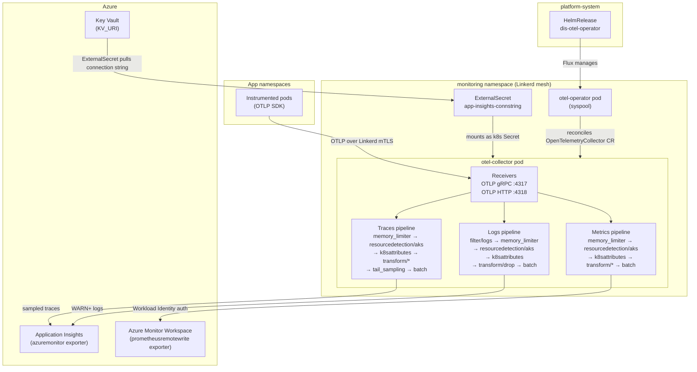
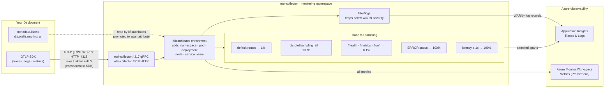

# OTel Collector

Deploys an OpenTelemetry Collector in the `monitoring` namespace, managed by the `otel-operator` running in `monitoring`. The collector receives OTLP telemetry from all Linkerd-meshed pods across the cluster, processes it, and exports traces/logs to Azure Application Insights and metrics to an Azure Monitor Workspace via Prometheus remote write.

## Architecture



## Developer View

What an application developer needs to know: configure your SDK to send OTLP to the collector's in-cluster address, optionally label your Deployment to control sampling, and your telemetry will appear in Application Insights (traces/logs) and Azure Monitor Workspace (metrics).



**SDK endpoint** — choose one based on your SDK's transport:
```
# gRPC
OTEL_EXPORTER_OTLP_ENDPOINT=http://otel-collector.monitoring.svc.cluster.local:4317

# HTTP
OTEL_EXPORTER_OTLP_ENDPOINT=http://otel-collector.monitoring.svc.cluster.local:4318
```

**To increase trace sampling rate** for a noisy-but-important service, add this label to your `Deployment`:
```yaml
metadata:
  labels:
    dis.otel/sampling: all   # sample 100% of non-health/metrics traces
```

Without the label the default rate is **1%**. Errors and slow requests (≥ 1 s) are always sampled regardless of the label.

## How It Works

### Operator → Collector

The `otel-operator` is installed via Helm by Flux. Its `HelmRelease` and `HelmRepository` live in `platform-system` (Flux's management namespace) but target the `monitoring` namespace. The operator watches `OpenTelemetryCollector` custom resources and reconciles the collector deployment defined in `base/collector.yaml`.

### Identity and Secrets

The `otel-collector` ServiceAccount carries Azure Workload Identity annotations (`CLIENT_ID`, `TENANT_ID`). This identity is used for two things:

- **Key Vault access** — an `ExternalSecret` pulls the Application Insights connection string from Key Vault and mounts it as a Kubernetes Secret consumed by the collector.
- **Azure Monitor Workspace** — the `azureauth` extension uses the federated token to authenticate Prometheus remote write requests.

### Linkerd Integration

The `monitoring` namespace has `linkerd.io/inject: enabled`, so collector pods are automatically meshed. Pods skip outbound port 443 (Azure Monitor endpoint) to avoid proxy interference with TLS. The `policies/` layer defines two Linkerd `Server` resources that open the OTLP ports (`4317`, `4318`) to all cluster traffic (`cluster-unauthenticated`), allowing any meshed pod across namespaces to send telemetry.

### Pipelines

| Pipeline | Key processors | Exporter |
|----------|---------------|----------|
| Traces | `k8sattributes`, `transform/azuremonitor` (OTel → legacy attrs), `transform/dis` (sampling hint), `tail_sampling` | `azuremonitor` |
| Logs | `filter/logs` (drop below WARN), `k8sattributes`, `transform/drop` (strip noisy attrs) | `azuremonitor` |
| Metrics | `k8sattributes`, `transform/metrics` (merge resource attrs into datapoint), `transform/drop` | `prometheusremotewrite` |

### Tail Sampling Strategy

| Policy | Condition | Rate |
|--------|-----------|------|
| `default` | Normal routes, no `dis.otel/sampling: all` label | 1% |
| `sample-all` | Deployment has label `dis.otel/sampling: all` | 100% |
| `heavy-sampling` | Routes matching `/metrics`, `/health`, `/kuberneteswrapper/*` | 0.1% |
| `always-sample-errors` | Span status is ERROR | 100% |
| `always-sample-slow-requests` | Span duration ≥ 1000 ms | 100% |

The sampling hint is propagated via the `dis.otel/sampling` label on the Deployment, read by the `k8sattributes` processor and promoted to a span attribute by `transform/dis`.

## Variables

| Variable | Default | Required | Description |
|----------|---------|----------|-------------|
| `CLIENT_ID` | — | Yes | Azure Workload Identity client ID for the `otel-collector` ServiceAccount |
| `TENANT_ID` | — | Yes | Azure tenant ID for the `otel-collector` ServiceAccount |
| `KV_URI` | — | Yes | Azure Key Vault URI used by ExternalSecret to fetch the App Insights connection string |
| `AMW_WRITE_ENDPOINT` | — | Yes | Azure Monitor Workspace Prometheus remote write endpoint |

## Layers

| Path | Description |
|------|-------------|
| `base` | Core resources: namespace, `OpenTelemetryCollector` CR, ServiceAccount, ClusterRole/Binding, ExternalSecret |
| `multitenancy` | Includes `base` + `policies`; entry point for Flux multitenancy deployments |
| `apps` | Alias for `base`; no additional changes |
| `policies` | Linkerd `Server` resources opening OTLP ports 4317 and 4318 to cluster-wide traffic |
| `adminservices` | Overlay that extends the collector with a `prometheus/headscale` receiver scraping Headscale metrics |