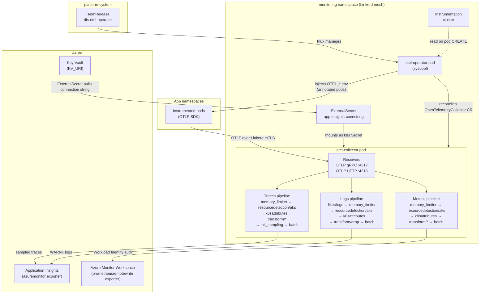
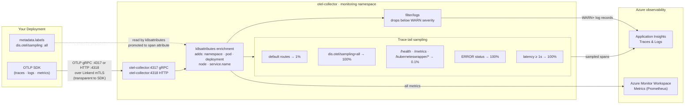

# OTel Collector

Deploys an OpenTelemetry Collector in the `monitoring` namespace, managed by the `otel-operator` running in `monitoring`. The collector receives OTLP telemetry from all Linkerd-meshed pods across the cluster, processes it, and exports traces/logs to Azure Application Insights and metrics to an Azure Monitor Workspace via Prometheus remote write.

## Architecture


```mermaid
flowchart TB
    subgraph ps["platform-system"]
        hr["HelmRelease\ndis-otel-operator"]
    end

    subgraph mon["monitoring namespace (Linkerd mesh)"]
        op["otel-operator pod\n(syspool)"]
        inst["Instrumentation\ncluster"]
        es["ExternalSecret\napp-insights-connstring"]
        subgraph col["otel-collector pod"]
            recv["Receivers\nOTLP gRPC :4317\nOTLP HTTP :4318"]
            proc_t["Traces pipeline\nmemory_limiter → resourcedetection/aks\n→ k8sattributes → transform/*\n→ tail_sampling → batch"]
            proc_l["Logs pipeline\nfilter/logs → memory_limiter\n→ resourcedetection/aks → k8sattributes\n→ transform/drop → batch"]
            proc_m["Metrics pipeline\nmemory_limiter → resourcedetection/aks\n→ k8sattributes → transform/* → batch"]
        end
    end

    subgraph apps["App namespaces"]
        app["Instrumented pods\n(OTLP SDK)"]
    end

    subgraph azure["Azure"]
        kv["Key Vault\n(KV_URI)"]
        ai["Application Insights\n(azuremonitor exporter)"]
        amw["Azure Monitor Workspace\n(prometheusremotewrite exporter)"]
    end

    hr -->|"Flux manages"| op
    op -->|"reconciles OpenTelemetryCollector CR"| col
    inst -.->|"read on pod CREATE"| op
    op -->|"injects OTEL_* env\n(annotated pods)"| app
    kv -->|"ExternalSecret pulls connection string"| es
    es -->|"mounts as k8s Secret"| col
    app -->|"OTLP over Linkerd mTLS"| recv
    recv --> proc_t & proc_l & proc_m
    proc_t -->|"sampled traces"| ai
    proc_l -->|"WARN+ logs"| ai
    proc_m -->|"Workload Identity auth"| amw
```

## Developer View

What an application developer needs to know: annotate your pod template so the operator points your SDK at the collector (or configure the endpoint yourself), optionally label your Deployment to control sampling, and your telemetry will appear in Application Insights (traces/logs) and Azure Monitor Workspace (metrics).


```mermaid
flowchart LR
    subgraph your_app["Your Deployment"]
        sdk["OTLP SDK\n(traces · logs · metrics)"]
        label["metadata.labels\ndis.otel/sampling: all"]
    end

    subgraph collector["otel-collector  ·  monitoring namespace"]
        direction TB
        ep["otel-collector:4317 gRPC\notel-collector:4318 HTTP"]

        subgraph sampling["Trace tail sampling"]
            s1["default routes → 1%"]
            s2["dis.otel/sampling=all → 100%"]
            s3["/health · /metrics · /kuberneteswrapper/* → 0.1%"]
            s4["ERROR status → 100%"]
            s5["latency ≥ 1s → 100%"]
        end

        enrich["k8sattributes enrichment\nadds: namespace · pod · deployment\nnode · service.name"]
        filter["filter/logs\ndrops below WARN severity"]
    end

    subgraph azure["Azure observability"]
        ai["Application Insights\nTraces & Logs"]
        amw["Azure Monitor Workspace\nMetrics (Prometheus)"]
    end

    sdk -->|"OTLP gRPC :4317 or HTTP :4318\nover Linkerd mTLS\n(transparent to SDK)"| ep
    label -.->|"read by k8sattributes\npromoted to span attribute"| enrich
    ep --> enrich
    enrich --> sampling
    enrich --> filter
    sampling -->|"sampled spans"| ai
    filter -->|"WARN+ log records"| ai
    enrich -->|"all metrics"| amw
```

### Automatic SDK configuration

Add one annotation to your pod template and the `otel-operator` injects the SDK environment from `Instrumentation/cluster` (`base/instrumentation.yaml`) when each pod is created. Only environment variables are injected — no init containers, sidecars or volumes — so your application keeps shipping its own OpenTelemetry SDK.

```yaml
spec:
  template:
    metadata:
      annotations:
        instrumentation.opentelemetry.io/inject-sdk: "monitoring/cluster"
        # only for pods with more than one application container
        instrumentation.opentelemetry.io/container-names: "app"
      labels:
        app.kubernetes.io/name: access-management
        app.kubernetes.io/version: "1.4.2"
```

What each selected container gets:

| Variable | Value |
|----------|-------|
| `OTEL_EXPORTER_OTLP_ENDPOINT` | `http://otel-collector.monitoring.svc.cluster.local:4317` |
| `OTEL_EXPORTER_OTLP_PROTOCOL` | `grpc` |
| `OTEL_SERVICE_NAME` | Derived — see *Service name* below |
| `OTEL_RESOURCE_ATTRIBUTES` | `k8s.namespace.name`, `k8s.pod.name`, `k8s.pod.uid`, `k8s.container.name`, `k8s.node.name`, `service.instance.id`, `service.namespace`, `service.version` (the `app.kubernetes.io/version` label, else the image tag), plus the name and UID of the owning workload (`k8s.deployment.*`, `k8s.replicaset.*`, `k8s.statefulset.*`, `k8s.daemonset.*`, `k8s.job.*`, `k8s.cronjob.*`) |
| `OTEL_PROPAGATORS` | `tracecontext,baggage` |
| `OTEL_TRACES_SAMPLER` | `parentbased_always_on` — the sampling decision is made by the collector's tail sampling |
| `OTEL_RESOURCE_ATTRIBUTES_POD_NAME`, `OTEL_RESOURCE_ATTRIBUTES_POD_UID`, `OTEL_RESOURCE_ATTRIBUTES_NODE_NAME`, `OTEL_POD_IP`, `OTEL_NODE_IP` | Downward API values that `OTEL_RESOURCE_ATTRIBUTES` refers to |

Once your telemetry looks right, delete the hand-written equivalents: `OTEL_EXPORTER_OTLP_ENDPOINT`, `OTEL_EXPORTER_OTLP_PROTOCOL`, `OTEL_SERVICE_NAME`, `POD_UID` and `OTEL_RESOURCE_ATTRIBUTES`.

**Service name** — the first match wins:

1. `OTEL_SERVICE_NAME` already set on the container
2. The `resource.opentelemetry.io/service.name` pod annotation
3. The `app.kubernetes.io/instance` label, then the `app.kubernetes.io/name` label
4. The owning Deployment, ReplicaSet, StatefulSet, DaemonSet, CronJob or Job, then the pod or container name

Helm sets `app.kubernetes.io/instance` to the release name, and it is checked **before** `app.kubernetes.io/name`. If your release name is not your service name, pin it with `resource.opentelemetry.io/service.name: <name>`. Otherwise the service is renamed in Application Insights, and dashboards, alerts and sampling rules keyed on the old name stop matching.

**Rules**

- The annotation and labels go on `spec.template.metadata`, **not** on the Deployment's own `metadata`. This is the most common mistake.
- Injection happens when a pod is **created**. Adding or changing the annotation does nothing until the pods are recreated, e.g. with `kubectl rollout restart`.
- Any `OTEL_*` variable your container already sets wins; the operator leaves it alone. `OTEL_RESOURCE_ATTRIBUTES` is the exception: the operator appends its attributes, skipping keys you already set. You can therefore add the annotation first and delete the hand-written variables in a later change.
- Without `instrumentation.opentelemetry.io/container-names`, only `.spec.containers[0]` is configured. In a Linkerd-meshed pod that is still your application container, because the operator sees the pod before Linkerd inserts `linkerd-proxy` at index 0. If the pod has more than one application container, list them — comma-separated names from `.spec.containers` or `.spec.initContainers`.
- Injection fails open. If the operator is unavailable, or the annotation names an `Instrumentation` that does not exist, the pod starts without the variables; the only trace is an error in the operator's log. Check the running pod (`kubectl get pod <pod> -o yaml`) after the first rollout.

### Manual SDK configuration

For workloads that do not opt in, set the endpoint yourself. Choose one based on your SDK's transport:
```bash
# gRPC
OTEL_EXPORTER_OTLP_ENDPOINT=http://otel-collector.monitoring.svc.cluster.local:4317

# HTTP
OTEL_EXPORTER_OTLP_ENDPOINT=http://otel-collector.monitoring.svc.cluster.local:4318
```

### Trace sampling

**To increase trace sampling rate** for a noisy-but-important service, add this label to your `Deployment`:
```yaml
metadata:
  labels:
    dis.otel/sampling: all   # sample 100% of non-health/metrics traces
```

Without the label the default rate is **1%**. Errors and slow requests (≥ 1 s) are always sampled regardless of the label.

## How It Works

### Operator → Collector

The `otel-operator` is installed via Helm by Flux. Its `HelmRelease` and `HelmRepository` live in `platform-system` (Flux's management namespace) but target the `monitoring` namespace. The operator watches `OpenTelemetryCollector` custom resources and reconciles the collector deployment defined in `base/collector.yaml`. It also serves the admission webhook that injects the SDK configuration from `Instrumentation/cluster` (`base/instrumentation.yaml`) into annotated pods; see `oci/otel-operator/README.md` for the webhooks and their failure modes.

### Identity and Secrets

The `otel-collector` ServiceAccount carries Azure Workload Identity annotations (`CLIENT_ID`, `TENANT_ID`). This identity is used for two things:

- **Key Vault access** — an `ExternalSecret` pulls the Application Insights connection string from Key Vault and mounts it as a Kubernetes Secret consumed by the collector.
- **Azure Monitor Workspace** — the `azureauth` extension uses the federated token to authenticate Prometheus remote write requests.

### Linkerd Integration

The `monitoring` namespace has `linkerd.io/inject: enabled`, so collector pods are automatically meshed. Pods skip outbound port 443 (Azure Monitor endpoint) to avoid proxy interference with TLS. The `policies/` layer defines two Linkerd `Server` resources that open the OTLP ports (`4317`, `4318`) to all cluster traffic (`cluster-unauthenticated`), allowing any meshed pod across namespaces to send telemetry.

### Pipelines

| Pipeline | Key processors | Exporter |
|----------|---------------|----------|
| Traces | `k8sattributes`, `transform/envoy` (legacy Envoy tags → OTel attrs), `transform/azuremonitor` (OTel → legacy attrs), `transform/dis` (sampling hint), `tail_sampling` | `azuremonitor` |
| Logs | `filter/logs` (drop below WARN), `k8sattributes`, `transform/drop` (strip noisy attrs) | `azuremonitor` |
| Metrics | `k8sattributes`, `transform/metrics` (merge resource attrs into datapoint), `transform/drop` | `prometheusremotewrite` |

### Envoy Spans

Envoy — and therefore every `envoy-proxy` fronting a Gateway — still tags spans with the pre-1.0 OpenTracing names (`http.method`, `http.url`, `http.status_code`) and sends every one of them as a string ([envoyproxy/envoy#30821](https://github.com/envoyproxy/envoy/issues/30821)). The `azuremonitor` exporter reads only the stable semantic conventions, and needs `http.request.method` before it will treat a span as HTTP at all, so untranslated Envoy spans land in Application Insights as a request literally named `ingress`, with no URL, no client IP and a `resultCode` taken from the span status instead of the HTTP status.

`transform/envoy` translates the tags on any span carrying `component=proxy` — including the `Int()` conversion the status code needs — so Envoy requests render like the Traefik ones. It pairs with `telemetry.tracing.tags` on the `eg` EnvoyProxy in `oci/envoy-gateway`, which supplies the few attributes that are not recoverable here because Envoy never puts them on the upstream (egress) span.

### Tail Sampling Strategy

| Policy | Condition | Rate |
|--------|-----------|------|
| `default` | Normal routes, no `dis.otel/sampling: all` label | 1% |
| `sample-all` | Deployment has label `dis.otel/sampling: all` | 100% |
| `heavy-sampling` | Routes matching `/metrics`, `/health`, `/kuberneteswrapper/*` | 0.1% |
| `always-sample-errors` | Span status is ERROR | 100% |
| `always-sample-slow-requests` | Span duration ≥ 1000 ms | 100% |

The sampling hint is propagated via the `dis.otel/sampling` label on the Deployment, read by the `k8sattributes` processor and promoted to a span attribute by `transform/dis`.

## Variables

| Variable | Default | Required | Description |
|----------|---------|----------|-------------|
| `CLIENT_ID` | — | Yes | Azure Workload Identity client ID for the `otel-collector` ServiceAccount |
| `TENANT_ID` | — | Yes | Azure tenant ID for the `otel-collector` ServiceAccount |
| `KV_URI` | — | Yes | Azure Key Vault URI used by ExternalSecret to fetch the App Insights connection string |
| `AMW_WRITE_ENDPOINT` | — | Yes | Azure Monitor Workspace Prometheus remote write endpoint |

## Layers

| Path | Description |
|------|-------------|
| `base` | Core resources: namespace, `OpenTelemetryCollector` CR, `Instrumentation` CR, ServiceAccount, ClusterRole/Binding, ExternalSecret |
| `multitenancy` | Includes `base` + `policies`; entry point for Flux multitenancy deployments |
| `apps` | Alias for `base`; no additional changes |
| `policies` | Linkerd `Server` resources opening OTLP ports 4317 and 4318 to cluster-wide traffic |
| `adminservices` | Overlay that extends the collector with a `prometheus/headscale` receiver scraping Headscale metrics |